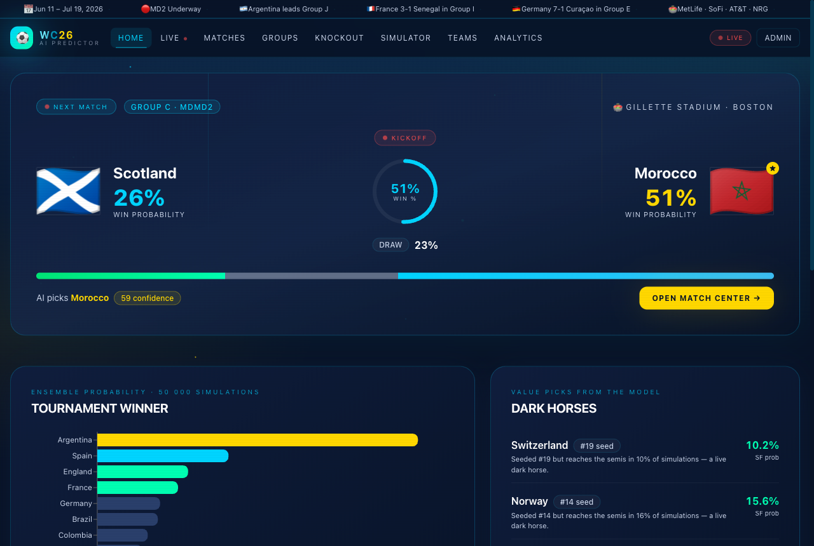
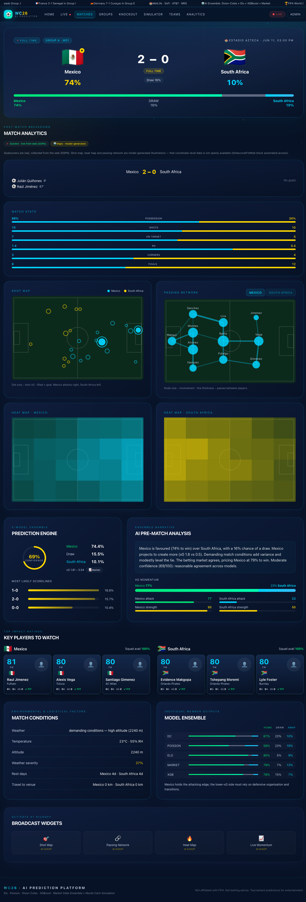

# ⚽ WC2026 — CAI (ChrisAI) Prediction Platform

**CAI (ChrisAI)** is a full-stack, continuously-learning prediction engine for the
**48-team 2026 FIFA World Cup** (USA · Canada · Mexico). It blends five
statistical/ML models into one calibrated forecast, runs a 50,000-iteration Monte
Carlo simulation of the whole tournament, and serves it behind a FastAPI backend
and a Next.js analytics dashboard. Every prediction ships with a plain-language
explanation and three concrete reasons the favoured team can win — not just
numbers. The UI labels its calls **"CAI picks"**.

🌐 **Live demo:** https://chris-fifaworldcup26-prediction.vercel.app

```
┌────────────┐   REST / JSON  ┌──────────────┐   artifacts   ┌─────────────────┐
│ Next.js UI │ ─────────────▶ │  FastAPI API │ ◀──────────── │   ML engine     │
│ (Tailwind, │                │  Redis cache │               │ Elo · Poisson · │
│  Recharts, │                │  (optional   │               │ Dixon-Coles ·   │
│  Framer)   │                │   Postgres)  │               │ XGBoost · NN ·  │
└────────────┘                └──────────────┘               │ MonteCarlo ·    │
                                                             │ SquadCondition  │
                                                             └─────────────────┘
```



> Post-match analytics: real goalscorers (scraped from ESPN) plus a model-generated
> shot map, passing network and heat maps.
>
> 

---

## Table of contents
- [What it predicts](#what-it-predicts)
- [How the prediction works](#how-the-prediction-works)
- [How calibration + dynamic weighting works](#how-calibration--dynamic-weighting-works)
- [Tech stack](#tech-stack)
- [Project structure](#project-structure)
- [Quick start](#quick-start)
- [Data & model pipeline](#data--model-pipeline)
- [Real match data (goalscorers)](#real-match-data-goalscorers)
- [API reference](#api-reference)
- [Frontend pages](#frontend-pages)
- [Deployment](#deployment)
- [Honest scope notes](#honest-scope-notes)
- [License](#license)

---

## What it predicts
- **Match outcome** — win / draw / loss probability for any fixture
- **Correct score** — top-3 most likely scorelines + expected goals (xG)
- **Confidence** — 0–100, based on model agreement + decisiveness
- **Three reasons to win** — squad-condition-driven, plain language
- **Group standings** — live MP / W / D / L / GD / Pts + advancement %
- **Knockout bracket (R32 → Final)** — group slots resolved from projected final
  standings, every tie run through the predictor, a **podium** (champion /
  runner-up / 3rd) and a per-tie **analysis modal** (player condition, manager
  record, goalkeeper, xG). Penalty shootouts flagged on level ties.
- **Tournament winner** — champion odds from 50k Monte Carlo runs
- **Dark horses & upset alerts** — teams over-performing their seed
- **Post-match analysis** — news-sourced (ESPN + others) write-up per completed
  match: headline, summary, star man, turning point, what was missing — plus real
  goalscorers and a model-generated shot/heat/passing map (clearly labeled)

## How the prediction works
Each match probability is an **ensemble blend** that degrades gracefully when a
member is missing:

| Member | Role |
|--------|------|
| **Elo** | Strength prior, margin-of-victory scaled, 150 yr of internationals |
| **Poisson** | Independent goal model |
| **Dixon-Coles** | Bivariate-Poisson with time decay (the score-matrix engine) |
| **XGBoost** | Feature classifier (form, rest, h2h, availability) |
| **Neural net** | PyTorch MLP (optional — off unless `torch` installed) |
| **Market odds** | De-vigged betting lines (strongest single signal) |

On top of the blend:
1. **Tournament momentum** — Elo is patched live with the actual WC2026 MD1/MD2
   results (`tournament_form.py`), so a 6-0 win immediately lifts a team.
2. **Squad condition** — `player_condition.py` builds a 0–1 condition score per
   team from player form, fitness, availability and attack/defence balance, then
   applies a logit shift to the win probabilities. The shift weights, highest
   first: **player form 0.55**, **manager track record 0.20**
   (`MANAGER_WINRATE`, all 48 head coaches), **goalkeeper quality 0.25 × delta**
   (`GK_QUALITY`, a curated keeper-strength table — added after Curaçao's keeper
   made 15 saves in a 0-0). Momentum is *excluded* from this shift to avoid
   double-counting the Elo patch.
3. **Conditions** — travel fatigue + weather severity nudge the result
   (deliberately down-weighted vs squad signals).
4. **Draw-aware pick** — the headline pick reports **"Draw"** when the draw
   probability is competitive and the sides are level, instead of always forcing
   a home/away winner.

The same squad-condition signal is baked into the **Monte Carlo simulation**:
each of the 2,256 pairwise Dixon-Coles score matrices is tilted by that matchup's
condition shift before sampling, so the champion odds reflect squad quality too.

## How calibration + dynamic weighting works
The engine separates **what it predicts** (the blend) from **how much to trust
it** (calibration + reliability). Three small artifacts, all fit offline by the
walk-forward backtest (`backtest.py` → `calibration.py`) over held-out World
Cups (2014/2018/2022) and consumed at runtime by `ensemble.py`. Every one
degrades to a safe default when missing or corrupt — the engine never hard-
depends on them.

| Artifact (`data/processed/`) | Fit from | Used for |
|------------------------------|----------|----------|
| `member_metrics.json` | per-member out-of-sample LogLoss/RPS/Brier + sample count | dynamic blend weights (∝ 1/LogLoss, capped, min-sample-gated) |
| `calibrator.json` | temperature / vector-temperature fit | post-blend probability calibration |
| `reliability.json` | ECE + confidence-bucket gaps | reliability-aware confidence |

- **Dynamic weights.** Each member is weighted by inverse out-of-sample
  LogLoss, normalized, clipped to `[WEIGHT_MIN, WEIGHT_MAX]`, and only trusted
  once it clears `MIN_MEMBER_SAMPLES` held-out matches. Falls back to the static
  `WEIGHTS` when evidence is thin.
- **Calibration.** A post-blend calibrator (`softmax(log p / T)`, scalar or
  per-class `T`) corrects probability magnitudes toward observed frequencies.
  It is **fit on earlier tournaments and adopted only if it beats identity on
  the held-out latest tournament** — otherwise it ships as the identity. No
  cosmetic sharpening.
- **Synthetic-market de-trust.** When no real book exists the market member is
  Elo-synthesised (a strictly degraded Elo clone). At predict time its weight is
  shrunk (`SYNTH_MARKET_WEIGHT_PENALTY`) and a few points of confidence are
  docked, so a fabricated "market" can't masquerade as signal.
- **Reliability-aware confidence.** `confidence` blends member *agreement* +
  *decisiveness* + *coverage* + *reliability* (recent ECE / bucket consistency),
  stays clipped to 5–99 and monotonic, and is **penalised when recent
  calibration is poor** — so a sharp-but-miscalibrated forecast doesn't report
  false certainty.

Rebuild the artifacts any time (idempotent): `cd backend/ml && python backtest.py`.

## Tech stack
- **Backend:** Python 3.14, FastAPI, Uvicorn, pandas/NumPy/SciPy, scikit-learn,
  XGBoost, (optional PyTorch), Redis (optional cache), Postgres (optional)
- **Frontend:** Next.js 14 (App Router), TypeScript, Tailwind, Recharts,
  Framer Motion, SWR
- **Data:** martj42 international results, ESPN open scoreboard API (scorers),
  Open-Meteo (weather), the-odds-api / API-Football (optional live feeds)

## Project structure
```
wc2026-prediction-platform/
├── backend/
│   ├── app/                    # FastAPI application
│   │   ├── main.py             # API entrypoint (uvicorn app.main:app)
│   │   ├── config.py           # settings (env-driven)
│   │   ├── fixtures.py         # real 2026 draw, schedule, results, squads
│   │   ├── services.py         # match cards / detail assembly
│   │   ├── match_analytics.py  # post-match analytics (scorers + maps)
│   │   ├── events.py           # ESPN goalscorer scraper + cache
│   │   ├── ml_engine.py        # bridge: app ↔ ml package, Redis cache
│   │   └── routers/            # /predict /matches /teams /simulate /admin …
│   ├── ml/                     # the model package (flat, importable)
│   │   ├── ensemble.py         # blends all members → calibrated forecast
│   │   ├── elo.py poisson.py model.py   # Elo, Poisson, Dixon-Coles
│   │   ├── xgb_model.py nn_model.py     # ML members
│   │   ├── player_condition.py # squad form/fitness → condition score + reasons
│   │   ├── tournament_form.py  # live MD1/MD2 Elo patch
│   │   ├── simulate.py         # 50k Monte Carlo tournament
│   │   ├── predict_wc2026.py   # full CLI prediction report
│   │   ├── retrain.py          # end-to-end pipeline (ingest→elo→fit→sim)
│   │   └── insights.py backtest.py …    # dark horses, walk-forward validation
│   ├── data/                   # raw + processed artifacts (mostly gitignored)
│   ├── refresh_events.sh       # daily goalscorer refresh (cron wrapper)
│   ├── validate_api.py         # live API smoke test
│   └── requirements.txt
├── frontend/                   # Next.js dashboard
│   ├── app/                    # routes: / live matches groups knockout
│   │   │                       #         simulator teams analytics admin
│   ├── components/             # ui.tsx, nav.tsx, match-analytics.tsx
│   └── lib/api.ts              # API client
├── docs/ARCHITECTURE.md        # deeper design notes
├── docker-compose.yml          # db + redis + backend + frontend
└── README.md
```

## Quick start

### Prerequisites
- Python 3.11+ and Node 18+
- macOS/Linux. (`brew install libomp` on macOS for XGBoost.)

### 1. Backend
```bash
python -m venv .venv && source .venv/bin/activate
pip install -r backend/requirements.txt
# optional NN member:
#   pip install torch --index-url https://download.pytorch.org/whl/cpu

# build ML artifacts (ingest → Elo → Dixon-Coles → XGBoost → Monte Carlo)
cd backend/ml && python retrain.py && cd ../..

# run the API → http://localhost:8000/docs
cd backend && uvicorn app.main:app --reload --port 8000
```

### 2. Frontend (new terminal)
```bash
cd frontend && npm install
npm run dev -- -p 3001     # → http://localhost:3001
```
The UI defaults to the API at `http://localhost:8000` (override with
`NEXT_PUBLIC_API_URL` in `frontend/.env.local`).

### 3. (optional) Docker — everything at once
```bash
cp .env.example .env        # edit secrets
docker compose up --build   # db + redis + backend + frontend
```

> **LAN / phone testing:** bind both servers to `0.0.0.0`
> (`uvicorn … --host 0.0.0.0`, `next dev -H 0.0.0.0`), point
> `NEXT_PUBLIC_API_URL` at your machine's LAN IP, and add that origin to
> `CORS_ORIGINS`.

## Data & model pipeline
Large artifacts (the 3.7 MB results CSV, the `.parquet` files, the `.pkl`
models) are **gitignored and regenerated** — keeps the repo lean. One command
rebuilds everything:

```bash
cd backend/ml && python retrain.py
```
This downloads the latest internationals → computes Elo → fits Dixon-Coles →
trains XGBoost → (NN) → runs the Monte Carlo sim → writes
`data/processed/meta.json` freshness. It's idempotent; rerun any time.

Small, real sample data **is** committed so the app works immediately:
`injuries.csv`, `odds.csv`, `weather.json`, `match_events.json`.

Generate a full CLI report (groups + knockout + final + 3 reasons each):
```bash
cd backend/ml && python predict_wc2026.py
```

## Real match data (goalscorers)
Goalscorers for played matches are **real**, scraped from ESPN's open scoreboard
JSON API (no key, no auth) by `backend/app/events.py`, cached to
`data/raw/match_events.json`. Refresh as games finish:
```bash
cd backend && python -m app.events
```
A daily cron wrapper is provided (`backend/refresh_events.sh`). Install it:
```bash
( crontab -l 2>/dev/null; \
  echo '0 8 * * * /ABSOLUTE/PATH/backend/refresh_events.sh # wc2026-events' ) | crontab -
```

Shot maps, heat maps and passing networks are **model-generated** (deterministic,
seeded by match id) and labeled as such — that coordinate-level data is not
openly available (providers like Sofascore/FotMob block automated access).

## API reference
| Method | Path | Notes |
|--------|------|-------|
| GET | `/api/health` | which ensemble members loaded |
| GET | `/api/predict?home=&away=&neutral=` | full ensemble prediction + 3 reasons |
| GET | `/api/matches` `?group=&team=&date=&matchday=` | fixture cards |
| GET | `/api/matches/{id}` | full match detail |
| GET | `/api/matches/{id}/analytics` | post-match scorers + maps (played only) |
| GET | `/api/simulate` | champion / stage odds |
| GET | `/api/simulate/groups` | live standings (MP/W/D/L/GD/Pts) + advancement % |
| GET | `/api/knockout` | bracket (R32 → Final) |
| GET | `/api/teams` · `/api/teams/{name}` | teams + profiles |
| GET | `/api/home` · `/api/insights` | dashboard + dark horse / upset feeds |
| POST | `/api/admin/login` → JWT; `/api/admin/retrain` 🔒 | admin |

Smoke-test a running API: `python backend/validate_api.py`

## Frontend pages
| Route | Content |
|-------|---------|
| `/` | featured match, title-odds chart, dark horses, model freshness |
| `/live` | up-next hero + all upcoming fixtures with live predictions |
| `/matches` · `/matches/[id]` | fixture list; full match center + post-match analytics |
| `/groups` | live group standings table + advancement % |
| `/knockout` | projected bracket (R32 → Final), podium, title-% per team, click-a-tie analysis modal |
| `/simulator` | champion-probability chart + stage-by-stage odds + group projections |
| `/teams` · `/teams/[name]` | all 48 teams by strength; profile + squad |
| `/analytics` | title chart, upset alerts, dark horses |

## Deployment
- **Frontend → Vercel** (auto-deploys from `main`, root dir `frontend`). Live at
  https://chris-fifaworldcup26-prediction.vercel.app
- **Backend → Render** (`render.yaml`, native Python, prebuilt ML artifacts, no
  boot retrain). See [DEPLOY.md](DEPLOY.md) for the step-by-step.
- **Backend-free demo:** `backend/gen_snapshots.py` dumps the read-only API to
  static JSON under `frontend/public/snapshot/`; the frontend falls back to those
  snapshots when no live backend is configured, so the Vercel site shows real
  data on its own. Refresh with `python backend/gen_snapshots.py` after new
  results, then push.

## Honest scope notes
- **Player / squad / injury data** is curated for marquee teams and generic for
  the rest, served from `fixtures.py`. Wire real feeds into the DB to make it live.
- **Betting odds + injuries + weather** are wired with offline sample caches and
  optional live feeds (`ODDS_API_KEY`, `INJURY_API_KEY`, Open-Meteo no-key).
- **Goalscorers + post-match analysis are real** (curated from ESPN and other
  outlets in `match_events.json` / `post_match.json`; an auto-summary covers any
  not-yet-curated completed match). **Shot/heat/pass maps are model-generated.**
- **Postgres is optional** — the API runs DB-free from the fixtures provider + ML
  artifacts. Enable with `USE_DB=true` then `python backend/seed.py`.
- **NN member** is off until `torch` is installed (intentional; heavy dep).
- A World Cup is a small sample with neutral venues and knockout variance —
  trust the distribution, not point predictions. Not affiliated with FIFA. Not
  betting advice.

## License
MIT © 2026 Christy Varghese — see [LICENSE](LICENSE).
